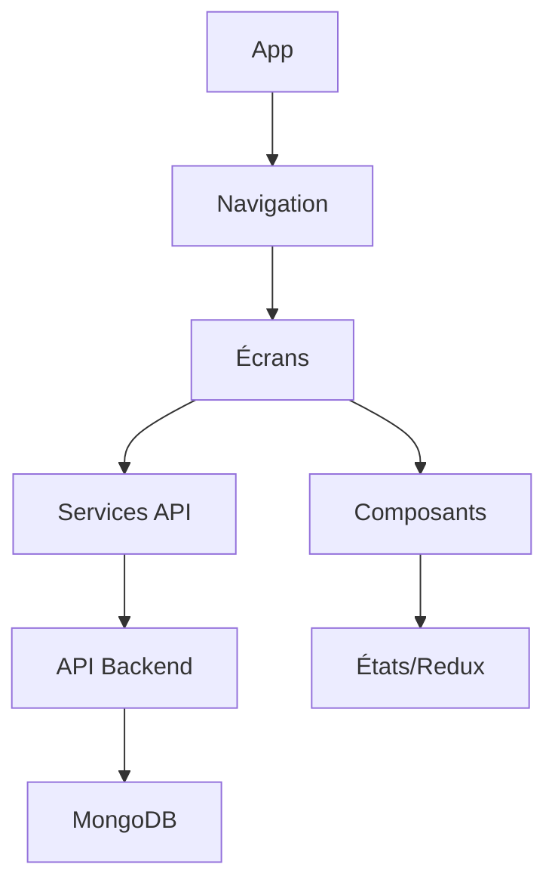

# Documentation Frontend - Application Budget

## Vue d'ensemble

Le frontend de l'application Budget est développé en React Native, conformément aux spécifications du projet. Cette documentation détaille l'architecture, la structure et les fonctionnalités du frontend.

## Technologies

- **React Native**: Framework de développement mobile cross-platform
- **Expo**: Plateforme simplifiant le développement React Native
- **MongoDB**: Base de données utilisée via l'API backend

## Architecture

Le frontend suit une architecture modulaire basée sur des composants réutilisables :



## Structure des fichiers

```
frontend/
├── assets/             # Ressources statiques (images, polices, etc.)
├── src/                # Code source principal
│   ├── config/         # Configuration (API, environnement)
│   ├── screens/        # Écrans de l'application
│   └── services/       # Services pour les appels API
├── app.config.js       # Configuration Expo
├── babel.config.js     # Configuration Babel
├── index.js            # Point d'entrée de l'application
├── package.json        # Dépendances et scripts npm
└── README.md           # Documentation
```

## Configuration API

La configuration de l'API se trouve dans le fichier `src/config/api.config.js`. Ce fichier contient :

- URL de l'API backend
- Timeout des requêtes
- Headers par défaut
- Fonctions utilitaires pour vérifier la disponibilité du backend

## Écrans principaux

L'application comporte les écrans suivants :

1. **Connexion/Inscription** : Authentification de l'utilisateur
2. **Tableau de bord** : Vue d'ensemble des finances
3. **Transactions** : Liste et détails des transactions
4. **Ajouter une transaction** : Formulaire de création
5. **Catégories** : Gestion des catégories
6. **Rapports** : Graphiques et statistiques
7. **Paramètres** : Configuration du compte utilisateur

## Connexion au backend

Les services API du frontend se connectent au backend FastAPI déployé sur http://localhost:8000 par défaut. Les points d'accès API suivent la structure RESTful :

- `GET /api/transactions` : Obtenir la liste des transactions
- `POST /api/transactions` : Ajouter une nouvelle transaction
- `GET /api/categories` : Obtenir la liste des catégories
- etc.

## État de l'application

L'état global de l'application est géré avec Redux :

- **auth** : État d'authentification de l'utilisateur
- **transactions** : Liste des transactions
- **categories** : Liste des catégories
- **ui** : État de l'interface utilisateur (chargement, erreurs, etc.)

## Déploiement

Pour déployer le frontend :

```bash
cd frontend
./deploy_test.sh
```

Ce script effectue les opérations suivantes :
1. Installation des dépendances NPM
2. Vérification de la disponibilité du backend
3. Démarrage du serveur de développement Expo

## Débogage

Les fichiers de log suivants sont disponibles pour le débogage :

- `frontend_deploy.log` : Journal principal du déploiement
- `frontend_debug.log` : Journal de débogage détaillé

## Bonnes pratiques

- Utilisation de composants fonctionnels avec les hooks React
- Séparation claire entre la logique métier et l'interface utilisateur
- Tests unitaires pour les composants clés
- Gestion centralisée des appels API
- Traitement cohérent des erreurs 