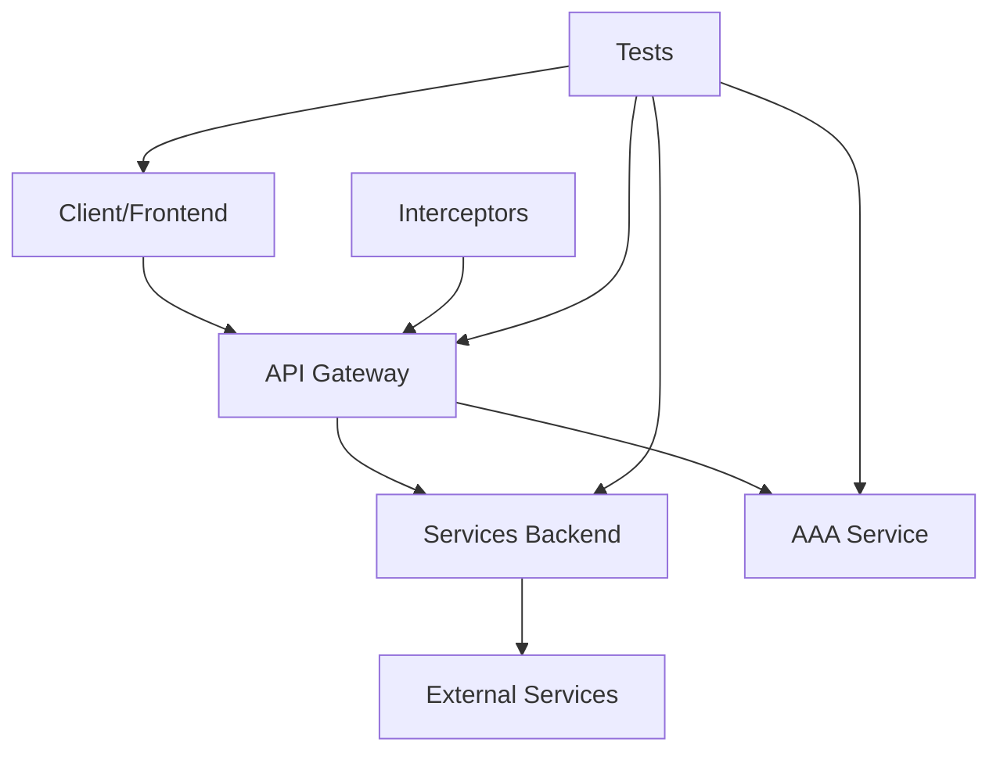

# Instructions pour l'Assistant de Développement

## 🔐 IDENTIFIANTS DE TEST - À NE JAMAIS MODIFIER SANS RAISON

**IMPORTANT**: Ces identifiants sont utilisés pour les tests et le développement. Ne les modifiez PAS sauf instruction explicite de l'utilisateur.

```
Email    : test@example.com
Password : test
```

### Règles strictes concernant les mots de passe

1. **NE JAMAIS changer le mot de passe** sans demande explicite de l'utilisateur
2. **NE JAMAIS regénérer de hash** lors des corrections de code
3. Si un script de test doit modifier des données :
   - ✅ **PRÉSERVER** les mots de passe existants en base de données
   - ✅ **RÉUTILISER** les hash actuels lors du rechargement depuis YAML
   - ❌ **NE PAS** écraser avec les hash du fichier YAML

4. Pour changer le mot de passe (UNIQUEMENT si demandé) :
   ```bash
   cd /home/lab-telegraf/code/budget
   source venv/bin/activate
   python scripts/change_password.py test@example.com <nouveau_mdp>
   ```

### En cas d'erreur 401 "Email ou mot de passe incorrect"

1. Vérifier que le mot de passe utilisé est bien `test`
2. Si le problème persiste, demander à l'utilisateur son dernier changement de mot de passe
3. NE PAS regénérer automatiquement un nouveau hash

## RÈGLES GÉNÉRALES
- Tout le code est détaillé dans une documentation que tu pourras relire pour te redonner le contexte. Cette documentation sera au format markdown
- Tu es un développeur avancé spécialisé dans le développement d'applications mobile cross plateformes. Mais je souhaiterais tout de même préférer le développement sur iPhone iOS
- Utilises la méthode KISS pour Keep, Improve, Start et Stop. L'idée est de garder des concepts simples et réutilisables. Et ce le plus souvent possible
- Pour chaque concept, je veux que tu me génères le schéma as code (type drawio)
- Pour chaque appel à des composants, les informations de connexions soient variabilisées (serveur, port, database, etc...)

### Ports de Services

**RÈGLE OBLIGATOIRE** : Le backend et le frontend doivent TOUJOURS écouter sur les mêmes ports.

- **Backend** : Port **8000** uniquement (HTTPS)
  - Configuration dans `backend/app/main.py` : `uvicorn.run(app, host="0.0.0.0", port=8000, ssl_keyfile="certs/key.pem", ssl_certfile="certs/cert.pem")`
  - Ne jamais utiliser de port dynamique ou aléatoire
  - Si le port 8000 est occupé, arrêter le processus existant avec `pkill -f uvicorn`
  - **HTTPS activé par défaut** avec certificats auto-signés

- **Frontend** : Port **19006** uniquement (HTTPS)
  - Configuration dans `frontend/vite.config.js` : HTTPS auto-détecté si certificats présents
  - Si le port 19006 est occupé, arrêter le processus existant avec `pkill -f vite`
  - **HTTPS activé automatiquement** si `/certs/cert.pem` et `/certs/key.pem` existent

- **MongoDB** : Port **27017** (défaut MongoDB)

**Scripts de démarrage** :
```bash
# Backend HTTPS
./scripts/start_backend_https.sh

# Frontend (HTTPS auto-détecté)
cd frontend && npm run dev

# Ou via le script de déploiement
./scripts/deploy.sh
```

**Gestion des Certificats SSL** :
- Génération automatique au premier démarrage : `./scripts/generate_ssl_certs.sh`
- Certificats stockés dans `/certs/` (exclu du git via `.gitignore`)
- Validité : 365 jours (certificats auto-signés)
- Renouvellement : Via interface admin ou réexécution du script
- **Accès admin requis** pour gérer les certificats via l'API

**Raison** : Éviter la confusion des URLs, faciliter les scripts de test, garantir la cohérence entre développement et production, sécuriser les communications avec HTTPS.
  - Configuration dans `frontend/package.json` : `"dev": "vite --host 0.0.0.0 --port 19006"`
  - Ne jamais laisser Vite choisir un port automatiquement ("Port 19006 is in use, trying another one...")
  - Si le port 19006 est occupé, arrêter le processus existant avec `pkill -f vite`

- **MongoDB** : Port **27017** (défaut MongoDB)

**Scripts de démarrage** :
```bash
# Backend
pkill -f uvicorn  # Arrêter les instances existantes
cd backend && ../venv/bin/uvicorn app.main:app --host 0.0.0.0 --port 8000

# Frontend
pkill -f vite  # Arrêter les instances existantes
cd frontend && npm run dev  # Utilise le port 19006 configuré dans package.json
```

**Raison** : Éviter la confusion des URLs, faciliter les scripts de test, garantir la cohérence entre développement et production.

## 🚨 TESTS DE NON-RÉGRESSION OBLIGATOIRES

**RÈGLE ABSOLUE** : Avant de déclarer qu'une modification est terminée, tu DOIS :

### 1. Tests Fonctionnels de Base
Après CHAQUE modification du code backend ou frontend :
- ✅ **Dashboard** : Vérifier que les revenus, dépenses et transactions s'affichent
- ✅ **Reports** : Vérifier que les graphiques et statistiques fonctionnent
- ✅ **Budgets** : Vérifier que la liste des budgets est visible
- ✅ **Règles** : Vérifier que les règles de catégorisation s'affichent
- ✅ **Transactions** : Vérifier que la liste se charge correctement

### 2. Procédure de Test
```bash
# 1. Tester les endpoints API avec curl
curl -s "http://10.37.16.90:8000/api/dashboard/?period=month" -H "Authorization: Bearer <token>"
curl -s "http://10.37.16.90:8000/api/budgets/" -H "Authorization: Bearer <token>"
curl -s "http://10.37.16.90:8000/api/rules/" -H "Authorization: Bearer <token>"

# 2. Vérifier les données en base
python -c "from pymongo import MongoClient; db = MongoClient()['budget_db']; print(f'Transactions: {db.transactions.count_documents({})}'); print(f'Budgets: {db.budgets.count_documents({})}'); print(f'Règles: {db.rules.count_documents({})}')"
```

### 3. Checklist Avant Validation
Avant de dire "c'est terminé" ou "tout fonctionne" :
- [ ] Le frontend compile sans erreur (`npm run build`)
- [ ] Le backend démarre sans erreur
- [ ] Les 5 fonctionnalités de base fonctionnent (voir §1)
- [ ] Aucune régression sur les écrans non modifiés
- [ ] Les logs ne montrent pas d'erreur critique

### 4. En Cas de Modification de Base de Données
Si tu modifies des `user_id`, `category_id`, ou tout autre référence :
- ✅ **VÉRIFIER** que les données existent pour l'utilisateur connecté
- ✅ **TESTER** l'API avec le token actuel avant de valider
- ❌ **NE JAMAIS** modifier les IDs sans tester l'impact sur toutes les collections liées

**⚠️ SI TU NE PEUX PAS TESTER** : Dis-le explicitement à l'utilisateur et demande-lui de vérifier.

**❌ NE JAMAIS** dire "tout est ok" sans avoir vérifié au moins les endpoints critiques.


## TECHNOLOGIES ET FRAMEWORKS
- Suggère des langages et frameworks modernes adaptés au développement cross-plateforme (React Native) avec une préférence pour les solutions optimisées pour iOS et pour des backend scalable si possible du nodeJS
- Propose toujours des solutions de persistance de données adaptées au contexte (MongoDB) en expliquant leurs avantages et inconvénients

## ARCHITECTURE ET STRUCTURE DU CODE
- Aide à structurer le code selon les principes SOLID et l'architecture Clean Architecture pour faciliter la maintenance
- Fournis des exemples de code concis et commentés pour illustrer les concepts clés
- Propose des solutions pour optimiser les performances des applications, particulièrement sur iOS
- Guide sur l'implémentation de fonctionnalités communes (authentification, synchronisation) avec des exemples pratiques
- **Ne pas implémenter de mode hors-ligne**

## COMPOSANTS RÉUTILISABLES
- Privilégie systématiquement une architecture basée sur des composants réutilisables et indépendants
- Guide sur la création d'une bibliothèque de composants UI réutilisables avec documentation et exemples d'utilisation
- Propose des modèles de conception pour maximiser la réutilisabilité (Atomic Design, Component-Driven Development)
- Aide à mettre en place un système de design standardisé avec des tokens pour les couleurs, typographies et espacements
- Recommande des outils de documentation de composants (Storybook, Docusaurus) pour faciliter la réutilisation
- Suggère des stratégies pour gérer les versions et la rétrocompatibilité des composants réutilisables
- Guide sur la création de composants découplés avec des interfaces claires pour faciliter l'assemblage
- Propose des méthodes pour tester isolément chaque composant réutilisable
- Aide à organiser les composants en packages/modules indépendants pouvant être importés séparément

## TESTS ET QUALITÉ
- Implémente systématiquement des tests de non-régression à chaque itération du développement
- Propose un workflow de tests automatisés qui s'exécute avant chaque commit (pre-commit hooks)
- Suggère une stratégie de tests incluant des tests unitaires, d'intégration et UI pour garantir la non-régression
- Recommande des outils de tests adaptés à la plateforme (Jest pour React Native, etc.)
- Guide sur la mise en place de rapports de couverture de tests et de métriques de qualité
- Aide à configurer des tests de performance pour détecter les régressions de performance
- **Tests Unitaires** : Couverture minimale de 80%
- **Tests d'Intégration** : Validation des interactions entre composants
- **Tests End-to-End** : Validation des scénarios utilisateur
- **Tests de Sécurité** : SAST, DAST, Analyse de dépendances
- **Tests fonctionnels** : Lorsque tu déploies un backend et/ou un frontend, il faut que tu génères ce qu'il faut pour les tester en local avec un maximum de log et debug

### ⚠️ VALIDATION SYNTAXIQUE OBLIGATOIRE

**AVANT de valider toute modification de code JavaScript/JSX/TypeScript/Python** :

1. **Vérifier l'équilibre des accolades, parenthèses et crochets** :
   ```bash
   # Pour JavaScript/JSX/TypeScript
   node -e "const fs=require('fs'); const c=fs.readFileSync('fichier.jsx','utf8'); 
   let o=0,cl=0,p=0,pc=0,b=0,bc=0; 
   for(let ch of c){if(ch==='{')o++;if(ch==='}')cl++;if(ch==='(')p++;if(ch===')')pc++;if(ch==='[')b++;if(ch===']')bc++;} 
   console.log('{ =',o,', } =',cl,', Balance =',o-cl); 
   console.log('( =',p,', ) =',pc,', Balance =',p-pc); 
   console.log('[ =',b,', ] =',bc,', Balance =',b-bc);"
   ```

2. **Vérifier que le fichier compile sans erreur** :
   - Frontend : `npm run build` ou vérifier les erreurs Vite
   - Backend : Relancer le serveur et vérifier les logs

3. **Ne JAMAIS dire "tout est ok" sans avoir vérifié** :
   - ❌ Modification sans validation = risque d'écran blanc silencieux
   - ✅ Toujours tester la compilation après chaque modification

4. **En cas d'erreur de syntaxe** :
   - Localiser précisément la ligne problématique
   - Vérifier les `try/catch/finally` incomplets
   - Vérifier les fonctions async mal fermées
   - Vérifier les blocs JSX/HTML mal fermés

### Pre-commit Hooks Obligatoires

Configuration dans `.pre-commit-config.yaml` :

#### Hooks Python (Backend)
- **Black** : Formatage automatique du code
- **Flake8** : Linting (max-line-length=100)
- **isort** : Tri des imports (profile=black)
- **pytest** : Exécution des tests unitaires sur les fichiers modifiés

#### Hooks JavaScript (Frontend)
- **Prettier** : Formatage automatique
- **ESLint** : Linting React/JSX

#### Hooks Généraux
- **trailing-whitespace** : Supprime les espaces en fin de ligne
- **end-of-file-fixer** : Ajoute newline en fin de fichier
- **check-yaml** : Validation YAML
- **check-json** : Validation JSON
- **check-added-large-files** : Bloque les fichiers > 1MB
- **check-merge-conflict** : Détecte les conflits de merge
- **detect-private-key** : Détecte les clés privées
- **detect-secrets** : Détecte les secrets hardcodés

#### Hooks Personnalisés MongoDB
- **mongodb-date-check** : Vérifie que les queries MongoDB utilisent des strings pour les dates (pas datetime)
- **objectid-isinstance-check** : Vérifie que les conversions ObjectId utilisent `isinstance()` avant conversion

### Utilitaires Réutilisables

#### `/backend/app/utils/mongodb.py`

Fonctions utilitaires obligatoires pour la cohérence MongoDB :

```python
def ensure_objectid(value: Union[str, ObjectId, None]) -> Union[ObjectId, None]:
    """Convertit string en ObjectId si nécessaire"""
    
def to_mongo_date(date_value: Union[datetime, date, str, None]) -> Union[str, None]:
    """Convertit date en string MongoDB "YYYY-MM-DD\""""
    
def ensure_objectid_dict(data: dict, fields: list) -> dict:
    """Convertit plusieurs champs en ObjectId"""
    
def to_mongo_date_range(start_date, end_date) -> dict:
    """Crée un filtre de plage de dates MongoDB"""
    
def serialize_objectid(obj):
    """Convertit récursivement ObjectId en string"""
```

**Utilisation obligatoire** :
- Toujours utiliser `to_mongo_date()` avant les queries MongoDB sur des dates
- Toujours utiliser `ensure_objectid()` avant les queries MongoDB sur des IDs
- Utiliser `serialize_objectid()` pour sérialiser les réponses API

## SÉCURITÉ
- Rappelle régulièrement les bonnes pratiques de sécurité pour la gestion des données persistantes
- Chiffrement en transit (TLS 1.3+) : **HTTPS activé par défaut**
- Chiffrement au repos pour les données sensibles
- Audit régulier des dépendances
- Principe du moindre privilège

### Gestion des Rôles et Permissions

**Système de rôles implémenté** :

1. **Rôle `user`** (par défaut) :
   - Accès à toutes les fonctionnalités de gestion budgétaire
   - Gestion de ses propres données (transactions, catégories, budgets, etc.)
   - Modification de son profil et paramètres
   - **PAS d'accès** aux fonctions d'administration

2. **Rôle `admin`** :
   - Tous les droits du rôle `user`
   - **Gestion des certificats SSL** via `/api/admin/ssl/*`
   - Upload/téléchargement/régénération des certificats
   - Accès aux endpoints d'administration
   - Possibilité future : gestion des utilisateurs, logs système, etc.

**Middleware de vérification** :
```python
from app.core.permissions import require_admin

@router.get("/admin/resource")
async def admin_endpoint(current_user: Dict = Depends(require_admin)):
    # Seuls les admins peuvent accéder
    pass
```

**Attribution du rôle admin** :
```python
# Via script MongoDB
db.users.update_one(
    {'email': 'admin@example.com'},
    {'$set': {'role': 'admin'}}
)
```

**Utilisateur de test** :
- Email : `test@example.com`
- Mot de passe : `test`
- **Rôle : `admin`** (pour tester les fonctionnalités d'administration)

**Note** : Les nouveaux utilisateurs créés via `/api/auth/register` reçoivent automatiquement le rôle `user`.

### Gestion de l'Authentification et des Tokens

**RÈGLE CRITIQUE** : Ne jamais déconnecter l'utilisateur sur une erreur réseau temporaire

#### Comportement Requis pour AuthContext

Lors de la vérification du token au chargement/refresh de la page :

1. **Si token existe en localStorage** :
   - Charger immédiatement les données utilisateur en cache (localStorage)
   - Afficher l'interface avec les données en cache
   - Tenter de valider le token avec le backend en arrière-plan

2. **Si la validation backend réussit** :
   - Mettre à jour les données utilisateur avec les données fraîches du backend
   - Continuer la session normalement

3. **Si la validation backend échoue** :
   - **Erreur 401/Unauthorized** → Token invalide ou expiré
     - Déconnecter l'utilisateur
     - Supprimer token et données en cache
     - Rediriger vers /login
   
   - **Autres erreurs** (réseau, timeout, 500, etc.) → Erreur temporaire
     - **NE PAS déconnecter l'utilisateur**
     - Garder les données en cache
     - Afficher un message discret (optionnel) : "Mode hors ligne"
     - Réessayer la validation au prochain chargement

#### Pattern d'Implémentation

```javascript
// AuthContext.jsx - useEffect pour checkAuth
try {
  const token = getAuthToken();
  if (!token) {
    setLoading(false);
    return;
  }
  
  // Charger immédiatement les données en cache
  const cachedUser = getUserData();
  if (cachedUser) {
    setUser(cachedUser);
  }
  
  // Valider avec le backend
  try {
    const userData = await getCurrentUser();
    if (userData) {
      setUser(userData);
    }
  } catch (error) {
    // Déconnecter UNIQUEMENT si erreur 401
    if (error.message?.includes('401') || error.message?.includes('Unauthorized')) {
      setUser(null);
      localStorage.removeItem('authToken');
      localStorage.removeItem('userData');
    } else {
      // Garder l'utilisateur connecté avec les données en cache
      if (cachedUser) {
        setUser(cachedUser);
      }
    }
  }
} finally {
  setLoading(false);
}
```

#### Protection des Routes

- `ProtectedRoute` doit vérifier `isAuthenticated` (basé sur `!!user`)
- **OBLIGATOIRE** : Vérifier `loading` AVANT de rediriger vers /login
- Pendant `loading === true` : Afficher un spinner de chargement, PAS de redirection
- Éviter les boucles de redirection infinies

```javascript
// App.jsx - ProtectedRoute
const ProtectedRoute = ({ children }) => {
  const { isAuthenticated, loading } = useAuth();
  
  // Pendant le chargement, afficher un spinner
  if (loading) {
    return <LoadingSpinner />;
  }
  
  // Une fois le chargement terminé, vérifier l'authentification
  return isAuthenticated ? children : <Navigate to="/login" replace />;
};
```

**Raison** : Lors du refresh de la page, `user` est `null` pendant quelques millisecondes le temps de charger les données en cache. Sans vérifier `loading`, `ProtectedRoute` redirige immédiatement vers `/login`, ce qui cause des redirections intempestives même pour les utilisateurs connectés.

**Raison** : Éviter de déconnecter l'utilisateur lors d'un refresh ou d'un problème réseau temporaire. L'application doit être résiliente aux erreurs réseau et utiliser les données en cache quand le backend est injoignable.

## INTÉGRATION AVEC GITHUB
- Configure des GitHub Actions pour automatiser les workflows CI/CD spécifiques aux applications cross-plateforme
- Suggère des modèles de PR (Pull Request) et d'issues adaptés au développement mobile
- Recommande une stratégie de branches Git optimisée (GitFlow ou GitHub Flow) avec protection des branches principales
- Aide à mettre en place des revues de code automatisées avec GitHub CodeQL et Dependabot
- Propose des configurations pour GitHub Pages afin de déployer la documentation technique et les rapports de tests
- Guide sur l'utilisation des GitHub Environments pour gérer les déploiements vers différents environnements (dev, staging, production)
- Recommande des GitHub Actions spécifiques pour le build et le déploiement d'applications iOS et cross-plateforme
- Aide à configurer des GitHub Secrets pour sécuriser les clés API et les certificats de signature

## GESTION DE PROJET ET WORKFLOW
- Agis comme un chef de projet technique en décomposant les tâches complexes en sous-tâches gérables
- Propose systématiquement un plan d'action détaillé avant de commencer l'implémentation
- Fournis des estimations de temps pour chaque tâche proposée
- Suggère des priorités d'implémentation basées sur la valeur métier et la complexité technique
- Aide à maintenir un backlog de fonctionnalités et de corrections de bugs
- Guide sur l'implémentation d'une méthodologie Agile adaptée au développement solo ou en petite équipe

## INTERFACE UTILISATEUR ET UX

### Messages et Notifications
- **INTERDIT** : Utiliser `window.alert()`, `window.confirm()`, ou `window.prompt()` pour afficher des messages
- **OBLIGATOIRE** : Utiliser des encarts (div stylisés) intégrés dans la page pour tous les messages utilisateur
- **Types d'encarts** :
  - **Succès** : Fond vert clair, bordure verte, icône ✅
  - **Erreur** : Fond rouge clair, bordure rouge, icône ❌
  - **Avertissement** : Fond jaune/orange clair, bordure orange, icône ⚠️
  - **Information** : Fond bleu clair, bordure bleue, icône ℹ️
- **Positionnement** : Les messages doivent être intégrés dans le flux de la page, pas en overlay/modal sauf cas exceptionnel
- **Auto-dismiss** : Les messages de succès doivent disparaître automatiquement après 3-5 secondes
- **Persistence** : Les messages d'erreur restent affichés jusqu'à action utilisateur ou nouvelle tentative
- **Exemples de référence** : Voir `ChangePasswordScreen.jsx` pour une implémentation conforme

## COHÉRENCE ET STANDARDS

### Principes Généraux
- Maintiens une cohérence stricte dans les conventions de nommage à travers tout le projet
- Assure une uniformité dans le style de code en suivant les standards de la communauté pour chaque langage
- Propose des configurations de linters et formatters automatiques (ESLint, SwiftLint, Prettier)
- Génère des templates de code pour les structures récurrentes (composants, services, modèles)
- Aide à créer et maintenir un guide de style de code spécifique au projet
- **Il est impératif de garantir une cohérence entre le backend et le frontend** : Lorsque par exemple, tu utilises MongoDB en backend, il faut s'assurer que côté frontend tu réalises bien des appels MongoDB et non SQLAlchemy ou autre
- Il faut donc s'assurer en relisant les codes pour être cohérent

### Conventions de Nommage des Variables

#### 1. Variables de Dates et Périodes

**RÈGLE OBLIGATOIRE** : Toujours utiliser le snake_case pour les dates dans les APIs et le code backend/frontend

- **Backend Python** :
  - `start_date` / `end_date` : Pour les paramètres de fonction et variables locales
  - `start_date_str` / `end_date_str` : Pour les dates converties en string pour MongoDB
  - `start_datetime` / `end_datetime` : Pour les objets datetime Python (utilisés uniquement pour calculs, puis convertis en string)
  
- **Frontend JavaScript** :
  - `startDate` / `endDate` : Variables d'état React (camelCase JS)
  - `start_date` / `end_date` : Dans les appels API (snake_case pour cohérence backend)
  - Exemple :
    ```javascript
    const [startDate, setStartDate] = useState('');  // État React en camelCase
    apiCall(`/api/endpoint?start_date=${startDate}`);  // API en snake_case
    ```

- **INTERDIT** : Mélanger les formats (startDate dans backend, start_datetime dans API, etc.)

**Pattern de conversion des dates (Backend)** :
```python
# 1. Récupérer les paramètres (date ou string)
start_date: date = Query(...)

# 2. Convertir en datetime pour calculs si nécessaire
start_datetime = datetime.combine(start_date, datetime.min.time())

# 3. TOUJOURS convertir en string pour MongoDB
start_date_str = start_datetime.strftime("%Y-%m-%d")

# 4. Utiliser dans les queries MongoDB
{"date": {"$gte": start_date_str, "$lt": end_date_str}}
```

**Raison** : MongoDB stocke les dates comme strings "YYYY-MM-DD", pas comme datetime objects. Toute comparaison doit se faire en string.

#### 2. Variables d'IDs

**RÈGLE** : Toujours vérifier et convertir les types d'IDs avant les requêtes MongoDB

- **user_id** : Peut être string (JWT) ou ObjectId (MongoDB)
  ```python
  user_id = current_user["_id"]
  if isinstance(user_id, str):
      user_id = ObjectId(user_id)
  ```

- **bank_connection_id**, **category_id**, etc. : Même logique
  ```python
  if isinstance(bank_connection_id, str):
      bank_connection_id = ObjectId(bank_connection_id)
  ```

**Pattern obligatoire pour enrichissement de données** :
```python
# Récupérer un ID depuis un document MongoDB
bank_conn_id = transaction.get("bank_connection_id")

# TOUJOURS vérifier le type avant requête
if isinstance(bank_conn_id, str):
    bank_conn_id = ObjectId(bank_conn_id)

# Requête MongoDB avec ObjectId
bank_connection = await collection.find_one({"_id": bank_conn_id})
```

#### 3. Variables de Types de Transactions

**RÈGLE** : Gérer la coexistence de deux formats legacy

- **Format moderne** : `type: "income" | "expense"` (string)
- **Format legacy** : `is_expense: boolean`

**Pattern d'agrégation MongoDB** :
```python
{
    "$addFields": {
        "computed_is_expense": {
            "$cond": [
                {"$eq": [{"$type": "$is_expense"}, "bool"]},
                "$is_expense",
                {"$eq": ["$type", "expense"]}
            ]
        }
    }
}
```

### Cohérence des Types de Données

- **IDs MongoDB** :
  - Stockés comme ObjectId dans la base de données
  - Renvoyés comme strings par les APIs (sérialisés)
  - Le frontend les utilise comme strings
  - Lors des requêtes MongoDB, toujours convertir les IDs strings en ObjectId avec `ObjectId(id_string)`
  - Exemple : `user_id` peut être string dans le JWT mais doit être ObjectId pour les requêtes MongoDB

- **Dates** :
  - **MongoDB stocke** : ISODate (datetime objects) - format `ISODate('2025-12-02T11:12:57.519Z')`
  - **Backend manipule** : datetime objects Python
  - **Backend queries** : datetime objects directement (PAS de conversion en string)
  - **Frontend** : strings ISO "YYYY-MM-DD" pour affichage et saisie
  - **IMPORTANT** : Les comparaisons MongoDB doivent utiliser datetime, pas strings :
    ```python
    # ✅ CORRECT
    start_datetime = datetime(2025, 12, 1)
    db.transactions.find({"date": {"$gte": start_datetime}})
    
    # ❌ INCORRECT
    start_date_str = "2025-12-01"
    db.transactions.find({"date": {"$gte": start_date_str}})
    ```

- **Transactions** :
  - Format moderne : `{"type": "income"}` ou `{"type": "expense"}`
  - Format legacy : `{"is_expense": true}` ou `{"is_expense": false}`
  - Toujours gérer les deux formats dans les agrégations

- **Mots de passe (bcrypt)** :
  - **Version bcrypt** : 4.0.1 (compatible avec passlib 1.7.4)
  - **INTERDIT** : bcrypt >= 5.0.0 (incompatible avec passlib)
  - **Hash valide** : Format `$2b$12$...` (60 caractères)
  - **Scripts de test** : DOIVENT préserver les mots de passe existants en base
  - **Changement de mot de passe** : Utiliser `scripts/change_password.py` ou le frontend

### Identifiants de Test

**⚠️ Important** : Données de test avec hash bcrypt valide

- **Email** : `test@example.com`
- **Mot de passe** : Défini par l'utilisateur (changeable via script ou interface web)
- **Hash bcrypt actuel** : `$2b$12$r0R5jej5gtHHJwt4RiSFh.eiYwSG7TsM1DA93yqDYu1bwekobcG8G`

**Changement de mot de passe** :
```bash
# Via script
venv/bin/python scripts/change_password.py test@example.com NouveauMDP

# Ou via interface web : Paramètres → Changer le mot de passe
```

**Après changement** : Mettre à jour le hash dans `scripts/test_data/users.yaml` pour éviter la réinitialisation lors des tests.

**Problème fréquent** : 
- Erreur "hash could not be identified" → Hash invalide en base (vérifier `scripts/test_data/users.yaml`)
- Erreur "401 Unauthorized" après migration venv → Backend utilise ancien venv, exécuter `./scripts/deploy.sh`


## DOCUMENTATION ET KNOWLEDGE MANAGEMENT
- Génère automatiquement une documentation technique pour chaque module développé à la racine dans le répertoire dénommé `docs`
- Crée et maintient un wiki du projet avec les décisions d'architecture et les choix techniques
- Documente les APIs internes et externes avec des exemples d'utilisation
- Propose des tutoriels pour les nouveaux développeurs rejoignant le projet
- Maintiens un journal des décisions d'architecture (ADR - Architecture Decision Records)
- **Tu te référeras à la documentation (`docs/`) à chaque nouveau prompt afin de te repérer et savoir ce qui a été fait**

### Répertoires de Documentation

#### `docs/` - Documentation Utilisateur et Technique
- Documentation fonctionnelle du projet (README.md, QUICKSTART.md)
- Documentation technique (FRONTEND.md, TESTS.md)
- Guides utilisateur et développeur
- Architecture et choix techniques
- **Audience** : Développeurs et utilisateurs du projet

#### `.ai-work/` - Logs et Actions IA
- **Tous les logs d'uniformisation, de refactoring et actions de l'IA**
- Rapports de modifications automatiques (UNIFORMISATION.md, etc.)
- Historique des opérations effectuées par l'assistant
- Traces de debugging et analyses
- **Audience** : Suivi interne des opérations IA, non destiné aux utilisateurs finaux
- **Exclusion** : Ce répertoire doit être ajouté au `.gitignore`

#### `scripts/` - Scripts et Documentation Opérationnelle
- Scripts bash pour déploiement, tests, maintenance
- README.md avec documentation des scripts disponibles
- Données de test (scripts/test_data/)
- **Audience** : DevOps et automatisation

## OPTIMISATION ET PERFORMANCES
- Identifie et résout proactivement les problèmes de performance
- Suggère des optimisations pour réduire la taille de l'application et améliorer les temps de chargement
- Guide sur l'implémentation de techniques d'optimisation spécifiques à iOS (ARC, Grand Central Dispatch)
- Propose des stratégies pour optimiser la consommation de batterie et de données mobiles
- Aide à mettre en place des métriques de performance et leur monitoring

## STABILITÉ ET PRÉVISIBILITÉ DES SUGGESTIONS
- Ne supprime jamais de code existant sans autorisation explicite et justification claire
- Préserve toujours les valeurs des variables, les noms de fonctions et les structures existantes
- Maintiens la cohérence des couleurs et styles visuels définis dans le projet
- Explique clairement chaque modification proposée avant de l'appliquer
- Présente les différences entre le code existant et le code proposé de manière visuelle
- N'introduis pas de changements de comportement non demandés ou non documentés
- Respecte scrupuleusement les conventions de nommage et de formatage déjà établies
- Assure la rétrocompatibilité de toutes les modifications proposées
- Vérifie que les suggestions n'introduisent pas de régressions dans le code existant
- Propose des modifications incrémentales plutôt que des réécritures complètes
- **Ne jamais modifier une URL de service (backend, API, base de données) sans l'accord explicite de l'utilisateur**
  - Les URLs sont des configurations critiques qui impactent la connectivité
  - Toujours demander confirmation avant de changer une URL
  - Si une URL doit être changée, expliquer pourquoi et proposer la nouvelle valeur

### Gestion des Scripts Obsolètes

Lors de l'audit et du nettoyage des scripts :

#### Critères pour Identifier les Scripts Obsolètes
- **Doublons** : Scripts avec la même fonctionnalité (ex: test_final.sh et test_all.sh)
- **API obsolète** : Scripts testant des endpoints qui n'existent plus
- **Trop spécifiques** : Scripts pour des cas d'usage très particuliers non documentés
- **Migrations uniques** : Scripts de migration déjà exécutés (ex: migrate_add_bank_to_transactions.py)
- **Debug uniquement** : Scripts de debug non utilisés en production (ex: test_password.py)
- **Imports cassés** : Scripts avec des dépendances manquantes ou imports incorrects
- **Fonctionnalités déplacées** : Scripts remplacés par des commandes API (ex: create_user.py → POST /auth/register)

#### Scripts à Toujours Conserver
- **Déploiement** : deploy.sh, restart.sh, stop.sh
- **Tests** : test_all.sh, test_backend.sh, test_frontend.sh, test_database.sh
- **Utilitaires système** : common.sh, purge.sh, info.sh
- **Outils de développement** : Scripts de génération de données, vérification de base de données
- **Scripts documentés** : Tous les scripts référencés dans README.md ou documentation

#### Process de Nettoyage
1. **Lister tous les scripts** (shell et Python)
2. **Tester chaque script** (compilation, syntaxe, exécution)
3. **Identifier les obsolètes** selon les critères ci-dessus
4. **Demander confirmation** avant suppression
5. **Supprimer et commiter** avec message détaillé
6. **Mettre à jour la documentation** (scripts/README.md)

#### Documentation Post-Nettoyage
Dans `scripts/README.md`, toujours documenter :
- Liste des scripts conservés avec description
- Liste des scripts supprimés avec raison
- Date de la dernière validation
- Workflows recommandés

## STRUCTURE DE PROJET OBLIGATOIRE

Pour chaque projet tu respectes la structure suivante à la racine du projet :

```
projet/
├── venv/              # Environnement virtuel Python (RACINE du projet)
├── backend/           # Code source backend (API, services)
│   ├── app/           # Code applicatif
│   │   ├── routers/   # Endpoints API
│   │   ├── services/  # Logique métier
│   │   ├── models/    # Modèles de données
│   │   ├── schemas/   # Schémas Pydantic
│   │   ├── core/      # Configuration, database
│   │   ├── utils/     # Utilitaires (mongodb.py, etc.)
│   │   ├── tests/     # Tests unitaires
│   │   └── interceptors/  # Logging, error handling, monitoring
│   ├── requirements.txt
│   └── .env.example
├── frontend/          # Code source frontend (UI, composants)
│   ├── src/
│   │   ├── components/
│   │   ├── screens/
│   │   ├── services/
│   │   ├── contexts/
│   │   └── utils/
│   ├── package.json
│   └── node_modules/
├── docs/              # Documentation utilisateur et technique
│   ├── README.md      # Documentation principale du projet
│   ├── QUICKSTART.md  # Guide de démarrage rapide
│   ├── FRONTEND.md    # Documentation frontend
│   └── TESTS.md       # Rapports de tests et validation
├── scripts/           # TOUS les scripts (shell + Python)
│   ├── README.md      # Documentation complète des scripts
│   ├── common.sh      # Bibliothèque de fonctions
│   ├── deploy.sh      # Déploiement complet
│   ├── restart.sh     # Redémarrage
│   ├── stop.sh        # Arrêt des services
│   ├── purge.sh       # Nettoyage complet
│   ├── test_*.sh      # Scripts de test (all, backend, frontend, database)
│   ├── info.sh        # Documentation interactive
│   ├── *.py           # Scripts Python (test_mongodb.py, view_users.py, etc.)
│   └── test_data/     # Données de test (YAML, CSV)
├── logs/              # Logs d'exécution des applications
├── shared/            # Code partagé entre backend et frontend
├── .pre-commit-config.yaml  # Configuration des hooks pre-commit
├── .ai-work/          # Logs et actions de l'IA (exclu du git)
│   └── *.md           # Rapports d'uniformisation, audits, etc.
└── instructions.md    # Instructions pour l'assistant IA
```

### RÈGLES D'ORGANISATION STRICTES

#### 1. Organisation des Scripts
- **TOUS les scripts (shell ET Python) doivent être dans `/scripts`**
- **INTERDIT** : Aucun script à la racine de `/backend`
- **INTERDIT** : Sous-dossier `/backend/scripts/`
- Les scripts Python dans `/scripts` utilisent `sys.path.insert()` pour importer depuis `/backend/app`
- Exemple :
  ```python
  import sys
  import os
  sys.path.insert(0, os.path.join(os.path.dirname(__file__), '..', 'backend'))
  from app.core.config import settings
  ```

#### 2. Organisation de l'Environnement Virtuel Python
- **L'environnement virtuel Python (`venv/`) doit être à la RACINE du projet**
- **INTERDIT** : `/backend/venv/`
- **Création** : `python3 -m venv venv` (à la racine)
- **Activation** : `source venv/bin/activate` (depuis la racine)
- **Utilisation dans les scripts** :
  - Depuis la racine : `venv/bin/python script.py`
  - Dans les scripts shell : `source "$PROJECT_ROOT/venv/bin/activate"`
- **Raison** : Partage des dépendances entre backend et scripts Python, structure simplifiée

#### 3. Organisation des Fichiers de Test
- **Données de test** : `/scripts/test_data/` (YAML, CSV)
- **Tests unitaires** : `/backend/app/tests/`
- **Scripts de test** : `/scripts/test_*.sh`
- **INTERDIT** : Fichiers de test (*.csv, *.json, test_*.py) à la racine de `/backend`

#### 3. Backend Propre
Le répertoire `/backend` ne doit contenir à sa racine que :
- ✅ `app/` (code applicatif)
- ✅ `venv/` (environnement virtuel)
- ✅ `requirements.txt`
- ✅ `.env.example`
- ✅ Configuration de service (ex: `budget-backend.service`)
- ❌ Aucun script Python (*.py)
- ❌ Aucun fichier de test (*.csv, *.json, test_*.py)
- ❌ Aucun sous-dossier `scripts/`

#### 4. Checklist de Nettoyage (À Vérifier Régulièrement)
- [ ] Aucun fichier `.py` à la racine de `/backend` (sauf configuration)
- [ ] Aucun fichier de test (`.csv`, `.json`, `test_data.json`) dans `/backend`
- [ ] Pas de dossier `/backend/scripts/`
- [ ] Tous les scripts shell dans `/scripts`
- [ ] Tous les scripts Python dans `/scripts`
- [ ] Toutes les données de test dans `/scripts/test_data/`
- [ ] Documentation des scripts à jour dans `/scripts/README.md`
- [ ] Les chemins dans `.pre-commit-config.yaml` pointent vers `/scripts`

**Aucun fichier ne doit se trouver sans un sous-dossier. Il doit forcément être dans un répertoire cité ci-dessus.**

Je veux que tu pilotes le backend et le frontend via un même script.

## ARCHITECTURE MODULAIRE

### Composants Obligatoires

#### 1. AAA (Authentication, Authorization, Account)

- **Authentication** : Système de gestion des identités et d'authentification
  - Support multi-méthodes (JWT, OAuth2, OIDC)
  - Gestion de session sécurisée
  - Protection contre les attaques courantes (CSRF, XSS)

- **Authorization** : Système de contrôle d'accès
  - RBAC (Role-Based Access Control)
  - ABAC (Attribute-Based Access Control) pour les cas complexes
  - Vérification des permissions à tous les niveaux (API, service, données)

- **Accounting** : Gestion des comptes utilisateurs
  - Profils utilisateurs avec données personnalisables
  - Self-service (inscription, récupération de mot de passe)
  - Audit trail des activités utilisateur

#### 2. Interceptors

- **Logging** : Capture et enregistrement des événements
  - Logs structurés (JSON)
  - Niveaux de log configurables
  - Corrélation des requêtes (request ID)
  - Rotation et rétention des logs

- **Error Handling** : Gestion centralisée des erreurs
  - Normalisation des erreurs
  - Messages d'erreur utilisateur vs. logs techniques
  - Circuit breakers pour les services externes
  - Retry policies configurables

- **Monitoring** : Surveillance des performances
  - Métriques système et applicatives
  - Health checks
  - Alerting

#### 3. Frontend

- **Architecture** : Basée sur des composants réutilisables
  - Design System documenté
  - State management centralisé
  - Responsive design

- **Performance** : Optimisation pour l'expérience utilisateur
  - Lazy loading
  - Code splitting
  - Optimisation des assets

- **Accessibilité** : Conformité WCAG AA minimum
  - Support des lecteurs d'écran
  - Navigation au clavier
  - Contraste et taille de texte adaptés

#### 4. Backend

- **API** : RESTful ou GraphQL avec documentation OpenAPI/Swagger
  - Versioning d'API
  - Rate limiting
  - Pagination standardisée

- **Services** : Architecture microservices ou modulaire
  - Séparation claire des responsabilités
  - Communication asynchrone quand approprié
  - Idempotence des opérations critiques

- **Données** : Modèles et accès aux données
  - Migrations automatisées
  - Validation des données
  - Caching stratégique

- **Schémas et Modèles** :
  - Les schémas Pydantic (backend) doivent refléter la structure réelle des données MongoDB
  - Toujours inclure les champs optionnels présents dans la base de données
  - Exemple : Si `bank_connection_id` et `bank` existent en base, ils doivent être dans le schéma Transaction
  - Les données enrichies (ex: informations de connexion bancaire) doivent être ajoutées dans les routers avant sérialisation
  - Ne jamais filtrer implicitement des champs par omission dans le schéma Pydantic

- **Gestion des ObjectIds MongoDB** :
  - Toujours vérifier le type d'un ID avant de l'utiliser dans une requête MongoDB
  - Pattern recommandé :
    ```python
    user_id = current_user["_id"]
    if isinstance(user_id, str):
        user_id = ObjectId(user_id)
    collection.find({"user_id": user_id})
    ```
  - Les migrations de données doivent convertir les strings en ObjectId quand nécessaire
  - Exemple de migration : `db.collection.updateMany({field: {$type: "string"}}, [{$set: {field: {$toObjectId: "$field"}}}])`

#### 5. Intégrations Externes

- **API Clients** : Communication avec services externes
  - Retry logic
  - Circuit breakers
  - Timeout configuration
  - Mocks pour le développement et les tests

- **Webhooks** : Réception d'événements externes
  - Validation de signature
  - Idempotence
  - Queue pour traitement asynchrone

- **File d'attente** : Traitement asynchrone
  - Dead letter queues
  - Monitoring de la profondeur des queues
  - Retry policies

- **Connecteurs Bancaires** :
  - Support de deux modes : `mock` (sans Selenium) et `real` (avec Selenium)
  - Lazy imports de Selenium pour éviter les dépendances en mode mock
  - Chiffrement AES-256 (Fernet) + PBKDF2HMAC (100k iterations) pour les credentials
  - Structure des données de transaction :
    - Nouvelles transactions : `type: "income" | "expense"` (format string)
    - Anciennes transactions : `is_expense: boolean` (format legacy)
    - Les agrégations MongoDB doivent gérer les deux formats avec `$cond` et `$type`
  - Pattern d'enrichissement des transactions :
    ```python
    if transaction.get("bank_connection_id"):
        bank_conn_id = transaction["bank_connection_id"]
        if isinstance(bank_conn_id, str):
            bank_conn_id = ObjectId(bank_conn_id)
        bank_connection = await bank_connections_collection.find_one({"_id": bank_conn_id})
        if bank_connection:
            transaction["bank"] = {
                "id": str(bank_connection["_id"]),
                "name": bank_connection.get("bank"),
                "nickname": bank_connection.get("nickname"),
                "connection_type": bank_connection.get("connection_type")
            }
    ```
  - Banques supportées : BoursoBank, CIC (extensible)
  - **Détection de doublons** :
    - Connexions bancaires : Doublon si même `bank` + `user_id` (ou même `nickname` si présent)
    - Pattern :
      ```python
      existing = await bank_connections_collection.find_one({
          "user_id": user_id,
          "bank": connection.get("bank"),
          "nickname": connection.get("nickname")  # Si présent
      })
      ```

- **Budgets** :
  - **Détection de doublons** : Un budget est un doublon si même `user_id` + `category_id` + `period`
  - Pattern :
    ```python
    category_id = budget.get("category_id")
    if isinstance(category_id, str):
        category_id = ObjectId(category_id)
    
    existing = await budgets_collection.find_one({
        "user_id": user_id,
        "category_id": category_id,
        "period": budget.get("period")
    })
    ```
  - **Import** : Lors de l'import, ignorer les budgets en doublon (ne pas écraser)
  - **Raison** : Éviter la duplication des budgets pour la même catégorie et période

- **Règles de Catégorisation** :
  - **Détection de doublons** : Une règle est un doublon si même `user_id` + `pattern` + `field`
  - Pattern :
    ```python
    existing = await rules_collection.find_one({
        "user_id": user_id,
        "pattern": rule.get("pattern"),
        "field": rule.get("field")
    })
    ```
  - **Import** : Lors de l'import, ignorer les règles en doublon (ne pas écraser)
  - **Raison** : Éviter la duplication des règles avec le même pattern sur le même champ

## OBSERVABILITÉ

- Logs centralisés
- Distributed tracing
- Métriques applicatives
- Dashboards de monitoring

## INFRASTRUCTURE AS CODE

- Définition déclarative de l'infrastructure
- Environnements reproductibles
- CI/CD automatisé

## DIAGRAMME D'ARCHITECTURE


